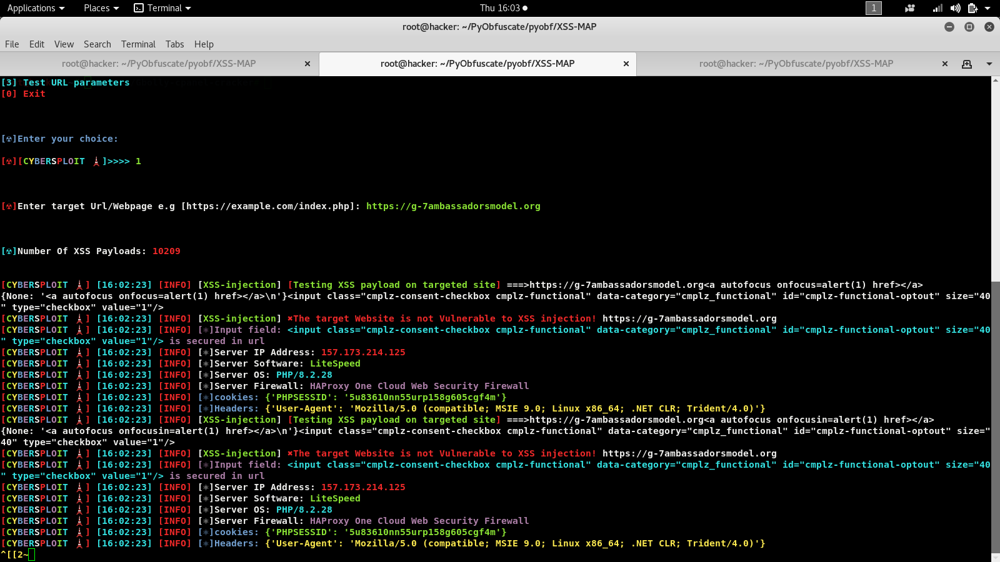

<h1 align="center">Xss-map🔎🔎🔎🔎</h1>
  

 
 Xss-map is a powerful XSS injection detection tool that helps identify Cross-Site Scripting (XSS) vulnerabilities in a web applications with 

 Over 10,000+ predefined payloads. 

 It scan for potential XSS vulnerabilities in the user-controllable input fields, given url parameters and JS attributes on the web pages within a given url 
 
 And its subdirectories
 
 It identifies and highlights the status of each input fields indicating whether it is "Vulnerable" or "Secure

 Also for vulnerable parameters thus providing information to the user about the potential security risks

 Xss-map can also detect the web application firewall🔥 (WAF) type the web server is using with the latest and updated firewall🔥 signature list

 Xss-map also fetch the web server OS and Server software from the response header and also fetch the web server IP address
 
 Xss-map also fetch response cookie headers from the response headers and also switch useragent per session  
 
 Xss-map also scan internal links within the website until all relevant pages have been checked

 This program uses 10,000+ predefined payloads  

 You can also add your own payloads to the payload wordlist if you like....

## Features

- Scans web pages and test for input fields by submitting payload on the input field
- Performs XSS security checks using 10,000+ predefined payloads
- Identifies and highlights the status of each input fields indicating whether it is "Vulnerable" or "Secure
- Scanning of web pages within the root directory and its subdirectories
- Scan for url parameters and JS attributes on the web pages within a given url 
- Can detect if a firewall🔥 is blocking your request or not 
- Can detect rate limiting 
- Fetch the web server OS and Server software from the response header
- Fetch the web server IP address
- Detect the web application firewall🔥 (WAF) type the web server is using the latest and updated firewall🔥 signature list
- Fetch response cookie headers from the response headers
- Switch useragent per session

## Screenshots
 

**Requirements**

- Python 3.x.x
- Required Python packages: 

---------------------------------
* re
* ssl
* random
* requests
* urlparse
* urllib
* socket
* BeautifulSoup
---------------------------------

## Command

  git clone https://github.com/Gbolahanomotosho/Xss-map

  cd Xss-map
 
  pip3 install -r requirements.txt
 
  python3 Xss-map.py

  or

  cd Xss-map

  chmod +x install.sh

  ./install.sh or bash install.sh

## Disclaimer: 

  For educational purpose only......
  
  

  I wont be responsible for any malicious use of this tool.......

